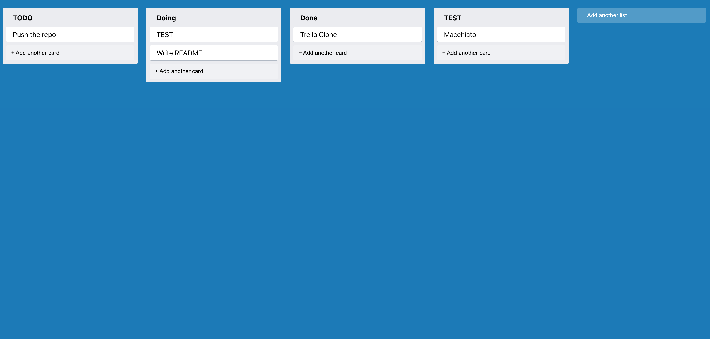
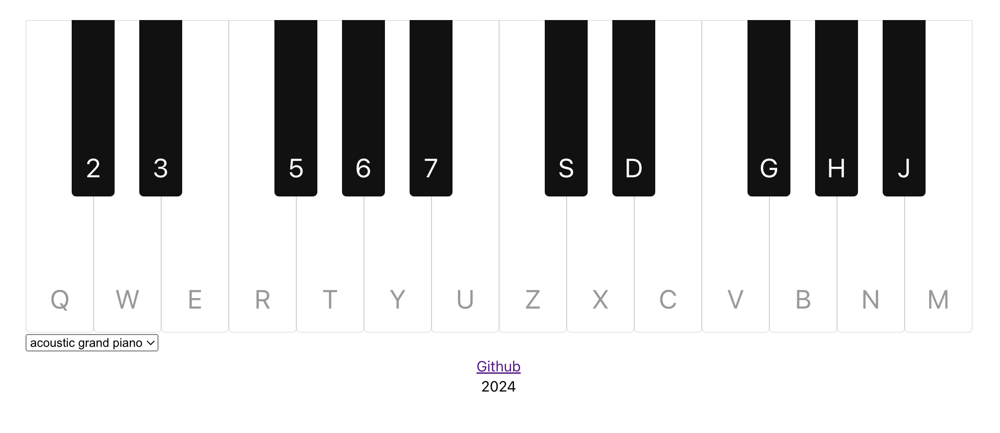
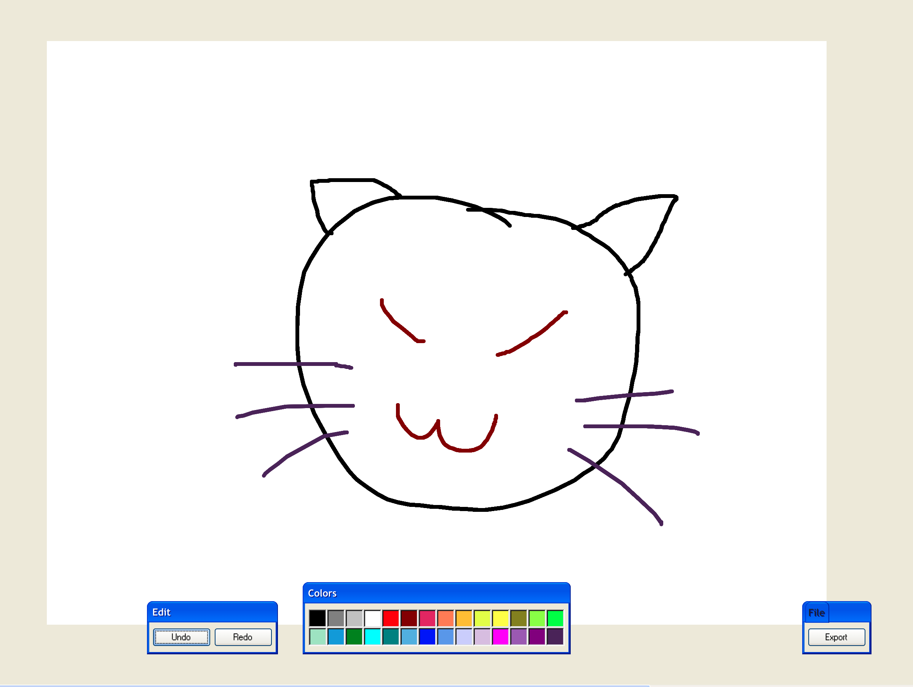

# Trello Clone Project
[Frontend](./task-organization/README.md)

[Backend](./trello-backend/README.md)

Web application allows user to create lists and tasks, also drag and drop them.

# Piano Project
[Frontend](./react-piano/README.md)

Web application allows user to play pinao and other instruments.

# Paint Project

[Frontend](./redux-paint/README.md)

Web application allows user to draw.

