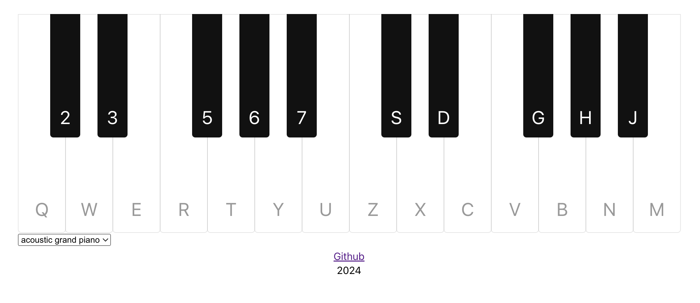

# Piano
This project was bootstrapped with [Create React App](https://github.com/facebook/create-react-app).
This project builds a piano that could be played via keyboard.
## Getting Started

### Install dependencies
 `npm install`

### Start the development server
`npm start`
Runs the app in the development mode.\
Open [http://localhost:3000](http://localhost:3000) to view it in the browser.

The page will reload if you make edits.\
You will also see any lint errors in the console.

## Introduction
The following libraries are chosen
- [clsx](https://www.npmjs.com/package/clsx) A tiny utility for constructing className strings conditionally.
- [soundfont-player](https://www.npmjs.com/package/soundfont-player) for playing MIDI sounds using WebAudio API.

