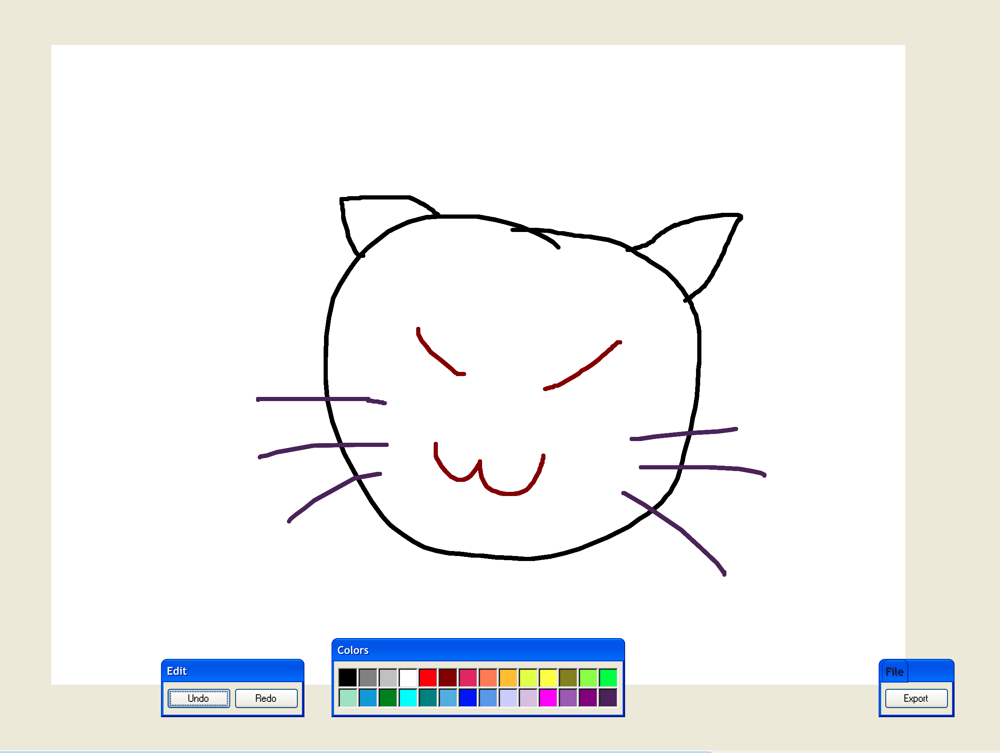

# Painting Project
This project was bootstrapped with [Create React App](https://github.com/facebook/create-react-app).
This project is a web application allows user to paint and save drawing.
## Getting Started

### Install dependencies
 `yarn`

### Start the development server
`yarn start`
Runs the app in the development mode.\
Open [http://localhost:3000](http://localhost:3000) to view it in the browser.

The page will reload if you make edits.\
You will also see any lint errors in the console.

## Introduction
The following libraries are chosen
- [redux](https://redux.js.org/) for state management
- [file-saver](https://www.npmjs.com/package/file-saver) for saving file on the client-side
- [xp.css](https://www.npmjs.com/package/xp.css) for styling

### Features
The web application shows a drawing canvas with Windows XP style. It allows user to pick up different colors through color panel, undo or redo the strokes, and save the drawing locally.

