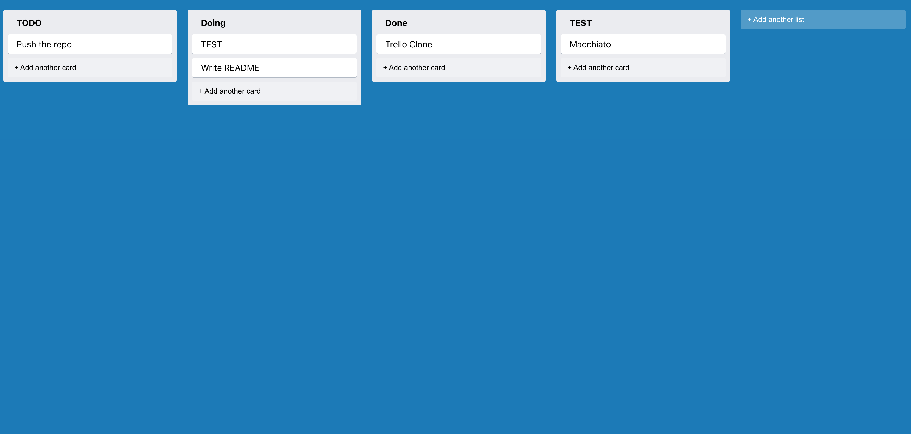

# Trello Clone Project (Frontend)
This project was bootstrapped with [Create React App](https://github.com/facebook/create-react-app).
This project demonstrates a task organization web application with similar functionality as Trello.
## Getting Started

### Install dependencies
 `npm install`

### Start the development server
`npm start`
Runs the app in the development mode.\
Open [http://localhost:3000](http://localhost:3000) to view it in the browser.

The page will reload if you make edits.\
You will also see any lint errors in the console.

To use the application, start the [backend server](../trello-backend/README.md).

## Introduction
The following libraries are chosen
- [nanoid](https://github.com/ai/nanoid) for string ID generation
- [react-dnd](https://react-dnd.github.io/react-dnd/about) for building drag and drop interfaces
- [react-dnd-html5-backend](https://react-dnd.github.io/react-dnd/docs/backends/html5) allow React DnD the HTML5 drag and drop API under the hood
- [throttle-debounce-ts](https://www.npmjs.com/package/throttle-debounce-ts) throttle and debounce functions written in Typescript
- [styled-components](https://styled-components.com/) for styling
- [use-immer](https://immerjs.github.io/immer/) for handling immutable data structures
### Features
The web application allows user to create new lists and tasks, also drag and drop them.

